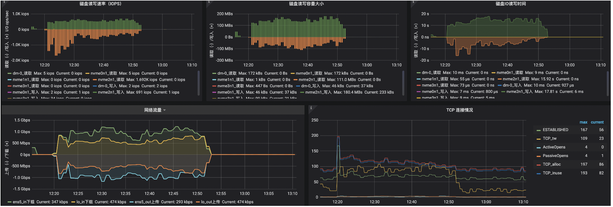

### hbase迁移方案


### 1. 背景

之前构建于aws emr的hbase，长期无人维护，数据存储基于s3， 业务反馈使用起来不是很稳定。

老集群情况：

* 节点：  1master + 3slave(4c16g) , region存储于s3
* 数据量: 1张表， 接近2亿key, qualifier数量不超过10个, 未开压缩，350G数据量。

要求：

* 迁移期间不影响业务读写


### 2. 方案

#### 2.1 方案选择

- 方案1: 先扩容老集群，每个rs均匀管理少量region时，将snapshot传输到远程新集群。 由于传输数据有350G， 可以考虑现在本地集群通过镜像复制新表，开启压缩后，再传输。 由于压缩和传输需要消耗cpu和网络资源会对集群造成些影响。

- - 优点：数据传输量小，稳定性有保证。
  - 缺点：迁移期间对业务有些影响

- 方案2:	基于aws emr创建只读hbase， 通过hbase 只读实例传输数据到远程新集群。 

- - 优点：对老集群没影响
  - 缺点：无法压缩需要传输大量数据

- 方案3: 基于方案2的方案，通过scan方式写入新集群。

- - 优点: 可控性强
  - 缺点: 对老集群有影响；需要开发；周期长

综合考虑后，决定采用 `方案2`。

#### 2.2 方案实施

##### 2.2.1 emr后台创建只读副本

[参考aws文档](https://docs.aws.amazon.com/zh_cn/emr/latest/ReleaseGuide/emr-hbase-s3.html#emr-hbase-s3-read-replica)

##### 2.2.2 业务主集群创建快照

```bash
#hbase shell 主集群
snapshot 'tbl', 'emr_tbl_201911131141'
```

##### 2.2.3 从只读副本迁移数据到新集群

* 只读集群做下同步:

```bash
#hbase shell 只读集群
refresh_meta
refresh_hfiles 'tbl'
```

* 开始迁移:

```bash
hbase org.apache.hadoop.hbase.snapshot.ExportSnapshot \
    -chuser hbase \
    -chgroup hdfs \
    -snapshot emr_tbl_201911131141 \
    -copy-to hdfs://xxxxx:8020/apps/hbase/data \
    -mappers 9 \
    -bandwidth 100
```

由于是只读副本，配置可以放肆一些，带宽、cpu啥的都可以打满使用。

其中, `hdfs://xxxxx:8020/apps/hbase/data`为新集群的路径。

##### 2.2.4 新集群数据整理

* 载入snapshot

  ```bash
  #bash shell
  restore_snapshot 'emr_tbl_201911131141'
  ```

* 其他优化修改（按需）

  * 添加压缩

  ```bash
  #bash shell
  alter 'tbl', {COMPRESSION=>SNAPPY}
  ```

  * 添加bloomfilter
  * 优化(合并/分割)分区

* 来此大合并（按需）

  ```bash
  major_compact 'tbl'
  ```

* 清理冗余的snapshot(按需)

  ```bash
  delete_snapshot 'tbl'
  ```

##### 2.2.5 相关监控

新集群3台机器8c32g + 600g(ssd/gp2), 迁移快照期间网卡、磁盘都被打满。

350G数据，大概1小时传输完毕。

添加压缩 + major compact持续1小时。

总共2小时完成迁移。




#### 参考

* [Hbase数据迁移方案介绍](https://www.cnblogs.com/ballwql/p/hbase_data_transfer.html)

* [HBase金融大数据乾坤大挪移](https://www.jianshu.com/p/cb4a645dd66a)

