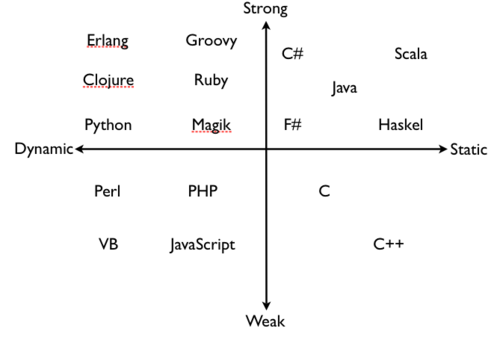

# Scala入门(一)

## 值和变量

Scala中有两个关键词,`val`(value)和`var`(variable),分别用来定义一个值和变量,一个值大体上可以等价于Java中带final修饰符的变量.下方展示了Scala中定义值和变量的方法以及在Java中大致等价的代码.

```scala tab=Scala
val a = 3
var b = "string"
```

```java tab=Java
final int a = 3;
String b = "string";
```

## 类型



上面一幅图介绍了现在各个主流编程语言的静态类型/动态类型,强类型/弱类型属性,关于这幅图片的原始文章可以看[这里](https://dustyprogrammer-blog.tumblr.com/post/16746798643/should-your-start-up-go-static-or-dynamic),网上还有许多讨论,比如[这里](https://segmentfault.com/a/1190000012372372)和[这里](https://www.zhihu.com/question/19918532),本文不再赘述.我主要想介绍的是,Scala其实是静态强类型语言,很多缺少了解的人粗略看一些源码,见到一个`var ...`就认为是JavaScript那样的动态弱类型语言,这个理解是错误的. 

为什么一个静态强类型语言会容易被人误认为是弱类型语言呢?这其中的关键在于[类型自动推导](https://zh.wikipedia.org/wiki/%E7%B1%BB%E5%9E%8B%E6%8E%A8%E8%AE%BA).有更多兴趣的人可以看看[知乎相关文章](https://www.zhihu.com/search?type=content&q=%E7%B1%BB%E5%9E%8B%E6%8E%A8%E5%AF%BC).如果您关心C++和Java的话,应该知道[C++11](https://en.cppreference.com/w/cpp/language/auto)和[Java11](https://openjdk.java.net/projects/amber/LVTIFAQ.html)都已经有了类型自动推导的特性,遗憾的是,由于实际工作环境中的历史遗留问题,很多C++和Java用户不知道什么时候才能真的用上这些特性.

在Scala里情况就好多了, Scala从最早的版本开始就支持类型自动推导,您可以打开Ammonite试试键入`val a=3`,和`val b:Int = 3`还有`val c: String = 3`看看结果.

```scala
➜  ~ amm
Loading...
Welcome to the Ammonite Repl 1.6.8
(Scala 2.13.0 Java 1.8.0_181)
If you like Ammonite, please support our development at www.patreon.com/lihaoyi
renkai-renkai@ val a = 3
a: Int = 3

renkai-renkai@ val b: Int = 3
b: Int = 3

renkai-renkai@ val c: String = 3
cmd2.sc:1: type mismatch;
 found   : Int(3)
 required: String
val c: String = 3
                ^
Compilation Failed
```

您可以看到,定义一个`val a = 3`,编译器会自动推导出`a`的类型是`Int`,如果您希望在代码里指定类型好在阅读源码的时候获得一些安全感,Scala当然也是支持的`val b: Int = 3`的效果和`val a = 3`效果一样,区别在于编译器不再为您做自动推导而是做一个检查类型是否匹配的工作,如果类型匹配没有问题,则相安无事.如果类型匹配出问题了,编译器会在编译期就抛出错误,从而避免更大的损失在运行期发生.  

## 表达式

如您所见,Scala中的`val`可以在Java中找到一个大致对应的关键词`final`,但是在实际工作经验中,Scala中的`val`出现的频率要远高于Java中的`final`.为什么会这样?这里就要提到一个概念叫表达式([Expression](https://en.wikipedia.org/wiki/Expression_(computer_science))). 在Java里,基础的[数学运算](https://docs.oracle.com/javase/tutorial/java/nutsandbolts/expressions.html)是表达式,[lambda表达式](https://docs.oracle.com/javase/tutorial/java/javaOO/lambdaexpressions.html)是表达式.还有什么呢?好像没有了.

在Scala里,情况就不太一样了,所有代码都会是表达式.举个例子,假设我们在没有充分利用Scala表达式特性的情况下想要根据不同的网络环境定义不一样的域名,可以这样写

```scala
  var urlString: String = null
  val hostName = InetAddress.getLocalHost.getHostName
  if (isInnerHost(hostName)) {
    urlString = "http://inner.host"
  } else {
    urlString = "http://outter.host"
  }
```

这段代码应该熟悉Java的人阅读起来都不会有什么困难,定义一个变量`urlString`,如果网络环境是内网,就把`"http://inner.host"`赋值给`urlString`,不然就将`"http://outter.host"`赋值给`urlString`.

这段代码能够工作良好,不过还有一些安全隐患,那就是在`urlString`被第一次赋值后,它就没有被再一次变更的必要了,可是编译器仍然为它保留着再一次被变更的可能性.也就是说,您可能在之后的代码中因为一些误操作改变`urlString`的值,造成bug.我的一位前同事就因为类似原因造成的bug排查不出来,查了一整天,几近崩溃.(当然,这和他变量名习惯起a1,a2...的恶习也分不开).

那么有什么办法能让`urlString`被赋上需要的值,又能让它在赋值后保持不变,避免被误操作修改呢?我们来看一个充分利用了Scala表达式特性的版本

```scala
val hostName = InetAddress.getLocalHost.getHostName
val urlString = if (isInnerHost(hostName)) {
  "http://inner.host"
} else {
  "http://outter.host"
}
```

`"http://inner.host"`是表达式,`"http://outter.host"`是表达式,`if(...) {...}else{...}`也是表达式,三个表达式一组合,我们就获得了我们需要的`urlString`,并且它是一个值而非变量,也就是说我们可以把它放心暴露在命名空间中而不用担心它被变更了.

## 习题

按照[材料准备](site:/index.md#习题集)里的提示把习题下载到本地,编辑`src/main/scala/quiz/Quiz1.scala`,更改文件中的`???`.在项目根目录下执行`./gradlew run --args='quiz.Quiz1'`,获得以下输出说明习题完成.

```
1 + 1 = 2
小目标达成
```

参考答案在`src/main/scala/answer/Answer1.scala`中